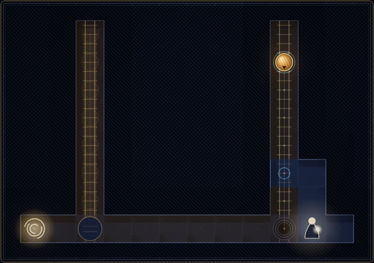
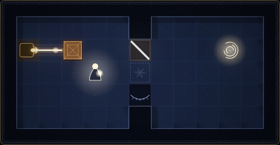
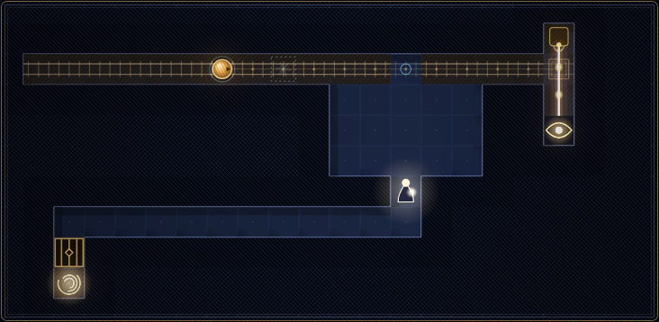

# What Must Be

A puzzle game built on two laws of nature that don't hold in our world, plus a third law that appears when both hold at once. Twelve levels in three chapters. The whole game is one self-contained HTML file of about 100 KB that makes no network requests.

**Play:** open [`dist/what-must-be.html`](dist/what-must-be.html) in a browser. Move with the arrow keys or WASD. Space waits, Z undoes, R restarts and Esc opens the level menu. Hover over anything and the game tells you why it is the way it is. On a touch screen, use the on-screen pad.

## I · Already

> Whatever you can no longer prevent has already happened.

Runners roll along rails, shuttles slide back and forth, and gates count down to closing. Each of these processes is either **live** or **fated**:

- A process is live if you could still interfere with it in time. That means your body, or one crate you push, could reach some cell of its future path before the process gets there. For a gate, you'd have to reach it before it closes. Anything that would collide with a live process is live too.
- Every other process is fated, and a fated process has already happened. It completes the instant it becomes fated, however far it still had to go.
- A shuttle you could never touch has no single position. It is smeared over its whole rail. Once you're able to reach it, it collapses to one position, the one its hidden phase gives.

The old principle says the past is what can no longer be prevented. Already turns it around: whatever can no longer be prevented counts as past. The boundary between past and future stops being a moment and becomes the edge of your reach. Playing it means reasoning backwards from the usual:

- You can't outrun what you can't stop. Say a runner you can't intercept is heading for a plate that locks a door. Then the door is already locked, even if you're standing next to it.
- To make something happen now, make yourself unable to stop it. Walking away from a process fast-forwards it, and so does putting a one-way tile between you and it.
- To pin down a machine that is everywhere at once, make yourself able to touch it.



*Level I·1. The left runner is sealed behind stone, so it has already filled its pit. You can still reach the right runner's path (blue ring), so that runner is still on its way.*

## II · Needed

> Nothing exists that makes no difference.

Lamps cast light, mirrors bend it, and eyes either see it or don't. Frost **veils** are walls that obey one law: a veil exists only if some eye would see differently without it. The comparison is made after every fated process has run its course.

- You can't break a veil, but you can make it pointless. Give its job to something else, like a crate in the beam or your own shadow, and the veil stops existing.
- A latent veil (dotted outline) condenses the moment it has a job to do.
- The world keeps its current veils while they are consistent. When they aren't, it makes the smallest change that restores consistency. Ties go to the veil nearest the lamp, measured along the light. A veil can't condense into an occupied cell. If no consistent arrangement exists, the veils flicker.

Formally, a set X of present veils is stable when every veil v is in X exactly when Out(X ∪ {v}) ≠ Out(X ∖ {v}). Out is the set of lit eyes once fated processes have completed.



*Level II·1 after four moves. The crate now blocks the beam, so the veil under the mirror has no job left and has gone latent.*

## III · Permission

> A change may reach the eyes only while you could still stop it.

Neither law says this on its own. It follows from the two together.

- Necessity is judged against the fated future. Suppose a runner becomes fated and its arrival would change what an eye sees. Then any latent veil in its path is suddenly necessary, so it condenses and stops the runner.
- A live runner has no fated future yet. The same veil isn't necessary, so the runner rolls straight through. If you let go of a runner, the world stops it for you. If you stay close enough to stop it yourself, it's allowed through. **Veto** is built on the first half and **Escort** on the second.
- A veil that touches no light can still be needed, because its job may be to keep you away from a smear. If you could reach the smear, it would collapse, and the shuttle's real position would change what an eye sees. The veil exists only to protect the fate that makes it necessary. It blinks open at exactly the moments when the hidden phase means your arrival would change nothing.



*Level III·2. You can still reach the runner's path (blue ring), so the runner is live. The latent veil just ahead of it stays latent, even though the runner is about to darken the eye on the right. If you walk away, the runner becomes fated and the veil condenses in front of it.*

## How it is drawn

Every visual element answers the question "why is this so?"

- **Time wash.** Cells you can reach are tinted cool blue: the open present. Cells you can't reach are hatched in sepia, because they're already the past.
- **Light and ghost light.** Gold beams are what the eyes actually see. Dashed cyan beams are the light a veil is holding back, which is the veil's reason to exist. A thread runs from each veil to the eye it serves.
- **Fate trails.** A process that completes in an instant leaves a trail like one of Marey's chronophotographs, with the whole motion recorded at once.
- **Smears.** A shuttle that is everywhere at once is drawn as a long exposure of its whole cycle. A faint spark marks its hidden phase.
- **Leashes and rings.** A dotted contour around each gate shows how close you must stay to keep it open. Blue rings mark where you could still intercept a live runner.
- **Tooltips.** Hover over any cell and the game explains why that thing is the way it is.

It is all plain Canvas 2D, with engraved hatching, a bloom pass, film grain and a plate frame.

## Levels

| Chapter | Levels |
|---|---|
| I · Already | Already, Commit, Doorstop, Power |
| II · Needed | Needed, Walk the Light, Chain, Both |
| III · Permission | Guardian, Escort, Veto, The Last Door |

A breadth-first solver running on the real rules checks every level. Shortest solutions range from 9 to 30 moves.

Each turn, you move or wait. Every process that is still running then takes one step: runners first, then shuttles, then gates. After that the world settles. Veils are chosen and fated processes complete, repeating until nothing changes. You win by standing on the exit.

## Nearest relatives

- **Already.** The necessity of the past (Aristotle, Diodorus Cronus, Ockham) holds that the past can't be prevented, and Already asserts the converse. Relativity's light cones also sort events by what you can affect, but they leave events outside both cones as neither past nor future, where Already counts everything you can't affect as past. The smear looks like quantum superposition, except that reach triggers it instead of observation and it collapses to a deterministic hidden phase. Games like Superhot tie time to the player's movement. Here time is tied to the player's power to intervene.
- **Needed.** The Eleatic principle (to be is to have causal power), verificationism and the legal but-for test (*sine qua non*) all tie existence or causation to making a difference. Needed turns that into a dynamic physical law with a stable-set fixpoint, so existence can pass from one object to another.
- **Permission.** No close relative found.

## Building and testing

You need Node. The playtest also needs Playwright.

```sh
node game/build.js                # writes dist/what-must-be.html and dist/artifact/what-must-be.html
node game/tools/export-levels.js  # solves every level with the engine's solver (about 90 s)
node game/tools/playtest.js       # plays each solution in the built page and checks that it wins
```

| Path | Contents |
|---|---|
| `game/src/engine.js` | The rules and the solver. Runs in Node and in the browser. |
| `game/src/levels.src.js` | The twelve levels, with the map legend at the top of the file. |
| `game/src/game.js` | Renderer, input, menus and tooltips. |
| `game/src/style.css`, `game/src/template.html` | The page shell. |
| `game/build.js` | Inlines everything into one HTML file. |
| `dist/what-must-be.html` | The finished game as a complete document. |
| `dist/artifact/what-must-be.html` | The same game without the document skeleton, for claude.ai Artifacts. |

## Embedding

`dist/what-must-be.html` is built to run in a sandboxed iframe, such as a LessWrong post widget. It makes no network requests and uses no storage. It sizes itself to its content and works at widths from 340 to 700 px. It takes keyboard focus when clicked and doesn't scroll the parent page.
